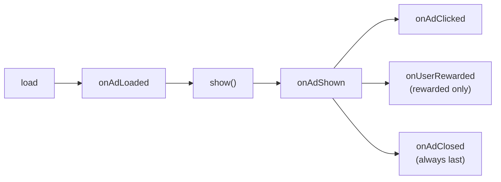

<div align="center">

# Adbustr Android SDK

**Rewarded, interstitial and banner ads for Android apps and games — in one lightweight, dependency-free library.**

[](CHANGELOG.md)
[-3DDC84?style=flat-square&logo=android&logoColor=white)](#requirements)
[](#requirements)
[](#why-adbustr)
[](#html-and-mraid-creatives)
[](LICENSE)

[Quick start](#quick-start) · [Formats](#formats) · [Error handling](#error-handling) · [Protocol](#ad-server-protocol) · [Changelog](CHANGELOG.md)

</div>

---

## Why Adbustr

- 🎯 **All the formats games need** — rewarded (video, display and playable), interstitial, banner / MREC.
- 🪶 **Zero dependencies** — `HttpURLConnection`, `org.json`, `VideoView` and the system `WebView`. No OkHttp, Glide, AndroidX or Play Services to clash with yours.
- ⚡ **Instant show** — images and videos are downloaded during `load`, so `show()` renders with no buffering.
- 🧩 **Rich media out of the box** — HTML creatives and HTML5 playables run in a built-in MRAID 3.0 container.
- 🛡️ **Safe by default** — creatives can't auto-redirect the user, all callbacks arrive on the main thread, and the SDK never throws into your code.

| Format | Status | Creatives |
|---|:---:|---|
| Rewarded | ✅ | VAST video · HTML display · MRAID playable |
| Interstitial | ✅ | image · HTML · MRAID |
| Banner / MREC | ✅ | image · HTML · MRAID |

---

## Requirements

| | |
|---|---|
| **minSdk** | 21 (Android 5.0) |
| **compileSdk / targetSdk** | 34 |
| **Java** | 8+ (no desugaring needed) |
| **Kotlin** | optional, fully compatible |

You'll get these from Adbustr when you sign up:

| Value | What it is |
|---|---|
| **Base URL** | the ad server, e.g. `https://rtb.adbustr.com` |
| **API key** | your app's token, sent in the `X-Adbustr-Key` header |
| **Site ID** | your app's identifier in Adbustr |
| **Zone IDs** | one per ad placement — main menu, level end, and so on |

---

## Installation

<details open>
<summary><b>Option A — prebuilt AAR</b></summary>

Put `adbustr-sdk-release.aar` into `app/libs/`:

```gradle
dependencies {
    implementation files('libs/adbustr-sdk-release.aar')
}
```

</details>

<details>
<summary><b>Option B — as a Gradle module</b></summary>

```gradle
// settings.gradle
include ':adbustr-sdk'
project(':adbustr-sdk').projectDir = file('../adbustr-android-sdk/adbustr-sdk')
```

```gradle
// app/build.gradle
dependencies {
    implementation project(':adbustr-sdk')
}
```

</details>

That's all — the ad `Activity`, permissions and R8 rules are merged into your app automatically.

---

## Quick start

### 1. Initialize once

```java
public class App extends Application {
    @Override public void onCreate() {
        super.onCreate();

        AdbustrSdk.initialize(this, new AdbustrConfig.Builder()
                .baseUrl("https://rtb.adbustr.com")
                .apiKey(BuildConfig.ADBUSTR_API_KEY)
                .siteId("YOUR_SITE_ID")
                .timeoutSeconds(2)             // optional, default 2
                .testMode(BuildConfig.DEBUG)   // verbose logcat under the "AdbustrSdk" tag
                .build());
    }
}
```

> [!TIP]
> Keep the API key out of source control — pass it in through a `buildConfigField` from `local.properties` or a CI secret.

`testMode` only turns on logging; it doesn't change requests or impressions.

### 2. Rewarded

```java
AdbustrSdk.loadRewarded(activity, "menu_reward", new AdLoadCallback<RewardedAd>() {
    @Override public void onAdLoaded(RewardedAd ad) {
        ad.setListener(new FullscreenAdListener.Adapter() {
            @Override public void onUserRewarded() { grantCoins(100); }
            @Override public void onAdClosed()     { resumeGame(); }
        });
        ad.show(activity);
    }

    @Override public void onAdFailedToLoad(AdError error) {
        resumeGame();
    }
});
```

The auction decides which kind of rewarded ad you get. Your code stays the same:

| Kind | Creative | Reward is granted |
|---|---|---|
| **Video** | VAST mp4 | when the video plays to the end. Skipping forfeits the reward |
| **Display** | HTML | after `reward_after` seconds on screen (15 by default) |
| **Playable** | HTML5 mini-game (MRAID) | after `reward_after` seconds on screen |

> [!NOTE]
> For display and playable ads, only time in the foreground counts. Until the reward is earned the ad can't be dismissed — no close button, Back is blocked, and `mraid.close()` from the creative is ignored.

### 3. Interstitial

```java
AdbustrSdk.loadInterstitial(activity, "level_end", new AdLoadCallback<InterstitialAd>() {
    @Override public void onAdLoaded(InterstitialAd ad) {
        ad.setListener(new FullscreenAdListener.Adapter() {
            @Override public void onAdClosed() { startNextLevel(); }
        });
        ad.show(activity);
    }

    @Override public void onAdFailedToLoad(AdError error) {
        startNextLevel();
    }
});
```

The close button appears after 3 seconds; Back is blocked until then.

### 4. Banner / MREC

```java
FrameLayout slot = findViewById(R.id.ad_slot);

AdbustrSdk.loadBanner(this, "main_menu_banner", slot.getWidth(), slot.getHeight(),
        new AdLoadCallback<BannerAd>() {
            @Override public void onAdLoaded(BannerAd ad) {
                banner = ad;
                slot.addView(ad.getView(MainActivity.this));
            }

            @Override public void onAdFailedToLoad(AdError error) {
                slot.setVisibility(View.GONE);
            }
        });

@Override protected void onDestroy() {
    if (banner != null) banner.destroy();
    super.onDestroy();
}
```

Pass the slot size in pixels — the SDK converts it to dp for the auction. The impression counts when the banner is actually attached to the screen, not when it loads.

---

## Formats

### Fullscreen lifecycle



What you can rely on:

- `onAdShown` fires exactly once;
- `onAdClosed` fires exactly once and always last;
- `onUserRewarded` always comes before `onAdClosed`;
- each ad object shows once — a second `show()` returns `AdError.ALREADY_SHOWN`;
- every callback runs on the main thread;
- the SDK never throws — failures arrive as `AdError`.

### Expiry

Every ad has a server-set `ttl`. Check it if you load well ahead of time:

```java
if (!ad.isExpired()) ad.show(activity);
```

### Preloading

Load early (e.g. when a level starts), show later (when it ends). Images and videos are cached during `load`. HTML creatives arrive with the response but only execute at `show()` — otherwise the demand partner would count an impression nobody saw.

### HTML and MRAID creatives

HTML creatives from demand partners run untouched in a `WebView`, so their own impression pixels, verification scripts (DoubleVerify, IAS…) and click trackers work exactly as on the web. Playables and rich media get an MRAID 3.0 container (`mraid.js`, `ready` / `viewableChange` / `exposureChange` / `sizeChange`, `open` / `close`).

| Behaviour | |
|---|---|
| Click | a navigation or `mraid.open()` within 3 s of a user tap — opens in the external browser or store |
| Auto-redirect | blocked (no tap, no navigation) |
| `intent://` links | supported, with `browser_fallback_url` |
| Sizing | centred and fitted: banners only scale down, fullscreen scales to fill |

---

## Error handling

| `AdError` | Meaning | What to do |
|---|---|---|
| `NO_FILL` | no ad for this request | normal — carry on |
| `TIMEOUT` | the server didn't answer in time | carry on, retry later |
| `NETWORK_ERROR` | no connectivity | carry on |
| `INVALID_ZONE` | zone empty or rejected | check the zone id |
| `NOT_INITIALIZED` | `initialize()` missing or config incomplete | check Base URL / API key / Site ID |
| `CREATIVE_LOAD_FAILED` | the creative didn't download | carry on |
| `PARSE_ERROR`, `INVALID_RESPONSE` | unexpected server response | contact support |
| `EXPIRED` | `ttl` elapsed | load a new ad |
| `ALREADY_SHOWN` | `show()` called twice | load a new ad |
| `DISPLAY_FAILED` | couldn't render | check the merged manifest and that the system WebView is installed |

Every value has a short `getMessage()`.

---

## Permissions and privacy

The SDK adds:

```xml
<uses-permission android:name="android.permission.INTERNET" />
<uses-permission android:name="android.permission.ACCESS_NETWORK_STATE" />
<uses-permission android:name="com.google.android.gms.permission.AD_ID" />
```

Each ad request sends:

| Group | Fields |
|---|---|
| Device | make, model, Android version, screen size, language, connection type, battery level |
| Advertising | advertising ID (GAID) and the Limit Ad Tracking flag |
| App | package name, name, version, SDK version |
| User | an anonymous SDK-generated ID (stored in `SharedPreferences`) and a session ID |

The GAID is read reflectively: if your app bundles `play-services-ads-identifier` the real ID is sent, otherwise an empty string. The SDK itself doesn't depend on Google Play Services. Declare the GAID and network access in Google Play's **Data safety** form.

---

## ProGuard / R8

Rules ship inside the AAR (`consumer-rules.pro`) and apply automatically.

---

## Building from source

```bash
git clone https://github.com/adbustr-core/adbustr-android-sdk.git
cd adbustr-android-sdk
echo "sdk.dir=$ANDROID_HOME" > local.properties
./gradlew :adbustr-sdk:assembleRelease
# → adbustr-sdk/build/outputs/aar/adbustr-sdk-release.aar
```

Requires JDK 17.

```
adbustr-sdk/src/main/java/com/adbustr/sdk/
├── AdbustrSdk, AdbustrConfig, AdError   public API
├── core/   networking, response parsing, device info, tracking, creative cache
├── ads/    InterstitialAd, RewardedAd, BannerAd
└── ui/     fullscreen Activity, HTML/MRAID renderer
```

---

## Ad server protocol

`POST {baseUrl}/sdk/v1/ad` with header `X-Adbustr-Key: <api key>`.

<details>
<summary><b>Request</b></summary>

```json
{
  "api": 1,
  "sid": "YOUR_SITE_ID",
  "zone": "menu_reward",
  "format": "rewarded",
  "caps": ["html", "mraid"],
  "w": 411,
  "h": 914,
  "app":     { "bundle": "com.example.game", "name": "Game", "ver": "1.4.0", "sdk": "0.2.0" },
  "device":  { "ifa": "…", "lmt": 0, "os": "android", "osv": "15",
               "make": "Google", "model": "Pixel 8", "w": 1080, "h": 2400,
               "lang": "en", "con": 2, "battery": 87 },
  "user":    { "uid": "…" },
  "session": { "id": "…", "depth": 3 }
}
```

| Field | Notes |
|---|---|
| `format` | `rewarded` · `interstitial` · `banner` · `native` |
| `w`, `h` | slot size in **dp** (the screen for fullscreen formats) |
| `device.w`, `device.h` | physical screen size in pixels |
| `caps` | renderers beyond image/video/native: `html` — raw markup in an `html` block, `mraid` — MRAID creatives |
| `device.con` | `0` unknown, `2` wi-fi/ethernet, `3` cellular |

</details>

<details>
<summary><b>Response</b></summary>

```json
{
  "status": "ok",
  "req_id": "…",
  "format": "rewarded",
  "ttl": 300,
  "video": { "url": "…", "w": 1080, "h": 1920, "duration": 30, "skip_after": 5, "click_url": "…" },
  "tracking": {
    "imp": ["…"], "click": ["…"], "start": ["…"],
    "q1": ["…"], "mid": ["…"], "q3": ["…"],
    "complete": ["…"], "skip": ["…"], "reward": ["…"]
  },
  "ord": { "erid": "…", "advertiser": "…", "inn": "…", "marked": 0 }
}
```

`{"status": "nobid"}` means no ad (`AdError.NO_FILL`). Instead of `video` the creative may come as:

| Block | Formats | Shape |
|---|---|---|
| `image` | interstitial, banner | `{ "url", "w", "h", "click_url" }` |
| `html` | interstitial, banner, rewarded — only if the request declared `caps: ["html"]` | `{ "adm", "w", "h", "reward_after"?, "base_url"? }` |
| `native` | native | `{ "title", "desc", "cta", "domain", "image", "icon", "click_url" }` |

`html.w` / `html.h` are the creative's size in CSS pixels; `reward_after` (rewarded only) is the number of seconds on screen before the reward; `base_url` resolves relative links in the markup.

</details>

---

## Support

- Integration and access: your Adbustr account manager
- Bugs and feature requests: [GitHub issues](https://github.com/adbustr-core/adbustr-android-sdk/issues)

## License

[Apache License 2.0](LICENSE) © Adbustr
